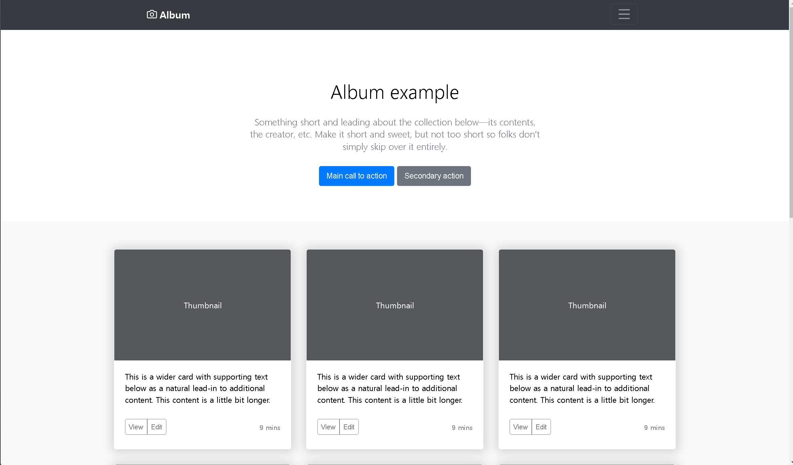
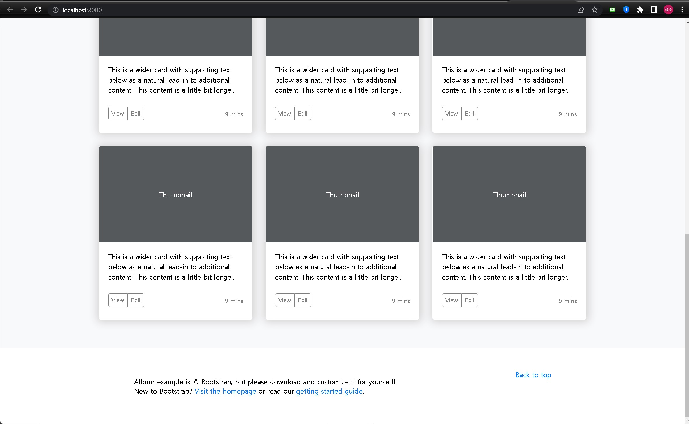

# 멋쟁이 사자처럼 11기 클론코딩 과제 🦁

이번 시간에는 그동안 배운 styled component와 React hook(useState, useEffect)을 사용하여 직접 클론코딩을 진행해볼 겁니다. 
이전 세션에 비해 다소 난이도가 올라갈 수 있으나 실제 구현되어있는 서비스를 직접 따라 만들면서 배우는 것만큼 빠르고 효과적인 공부법은 없으니까요. 
모두 화이팅!
  

# 실습 진행방법

이번 주차는 과제 중심으로 세션이 진행됩니다! 
직접 Component를 만들어서 아래의 홈페이지와 같은 페이지를 구현해보세요.

https://getbootstrap.com/docs/4.3/examples/album/

 

## 어른 사자의 길

1. 우측 상단 햄버거 버튼 클릭 시 진행되는 동적 기능
2. 기타 애니메이션 효과
3. 하단 Footer

# 구현 화면
(이곳에 구현한 이미지를 `이곳에` 첨부해주세요. 아래는 예시 이미지입니다.)

# 컴포넌트 계층 구조 
주된 컴포넌트인 헤더, 푸터, 포토카드(사진과 글이 있는 것), 버튼에 대해 어떤 계층으로 설계했는지 `이곳에` 작성해주세요.
그리고 자식 컴포넌트 들에 대해서 어떤 의도를 갖고 설계했는지(ex 정렬하기 위해서, border를 주기 위해서 등) 부담없이 간단하게 적으면 됩니다.
(아래는 예시입니다.)

#index.html
 
코드를 작성해서 기본 설정된 margin=8 값을 0으로 초기화

#navigate.jsx

import { AiOutlineMenu } from "react-icons/ai";
import { FiCamera } from "react-icons/fi";
*아이콘 import를 통해 bar에서 사용

Top
*상위 bar구역 큰틀 지정

Title
*Ficamera 아이콘과 이름을 묶어서 상위바 왼쪽에 자리시킴

Name
*이름을 지정, 크기와 margin 결정

Button
*menu 아이콘을 지정하고 이를 둘러싸는 테두리 설정

#rheader.jsx

TitleBlock
*가장 큰 틀 지정, 세로로 flex

MainTitle
*가장 큰 title 제목

SubTitle
*부제목

Button
*Button 틀 지정

MainButton
*첫번째 버튼

SecondButton
*두번째 버튼

#card.jsx

CardBlock
*가장 큰 틀 지정, flex-wrap로 설정해서 카드 3개가 넘어가면 다음열로
예시 페이지에서는 창 크기를 줄여도 한열에 3개씩 표시되는데 이를 구현하려면 grid를 사용해야하는 것으로 추정,, 다음에 해보겠습니다.
flex로도 33%씩 나누어 사용하면 한열에 아이템 수를 지정 가능하다.

CardEach
*카드개별 설정

CardText
*카드 하단에 들어갈 내용 설정

Thumbnail
*카드 상단에 들어갈 thumbnail 사진 설정

CardUnder
*카드 최하단 버튼 부 설정

CardButton
*하단에 들어갈 버튼 틀

CardButton1
*하단에 들어갈 첫번째 버튼

CardButton2
*하단에 들어갈 두번째 버튼

CardTime
*하단에 들어갈 시간표시 설정

#footer.jsx

FooterBlock
*페이지 최하단에 들어갈 Footer의 큰틀 설정

Text1
*왼쪽에 들어갈 내용설정 및 링크삽입

Text2
*오른쪽에 들어갈 내용 설정

GoToUp
*반응형 GoToUp 글자 설정